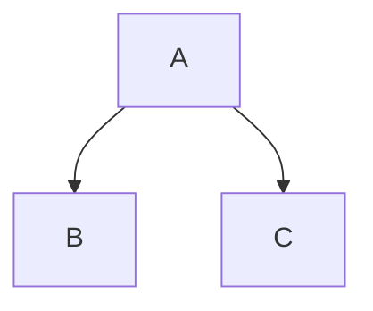
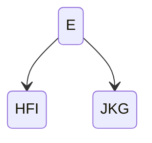

# 根据先序遍历序列、中序遍历序列画二叉树

某二叉树的先序遍历序列是 **EFHIGJK** , 中序遍历序列是 **HFIEJKG** ,画出该二叉树。

1、由先序**EFHIGJK**可知E是根节点。
2、由中序**HFIEJKG**,可知**HFI**在根节点左边，**JKG**在根节点右边，示意图如图1：

​         E

HFI        JKG

3、左边节点序列:先序是**FHI**,所以F是根节点。
4、左边节点序列:中序**HFI**，所以H左I右,示意图如图2：

5、右边节点序列:先序是**GJK**,所以G是根节点。
6、右边节点序列:中序**JKG**，所以**JK**都在G左边,示意图如图3：

7、先序是**JK**,所以J是根节点。
8、中序**JK**，所以K在J右边,示意图如图4：

