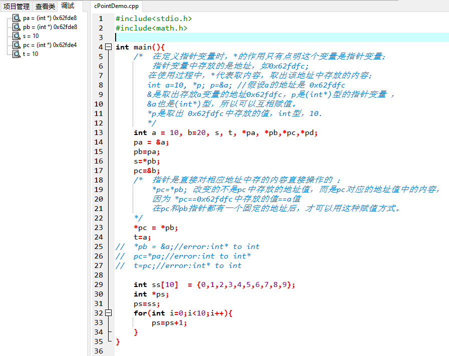
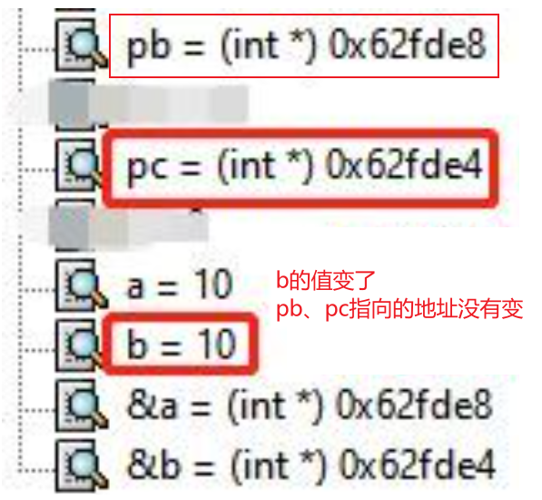
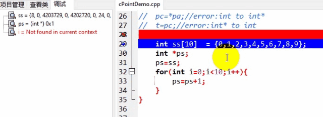

# C指针学习笔记

## 【代码】

```c
#include<stdio.h> 
#include<math.h>

/**
* 指针变量自身也占用内存，且所有指针占用内存的大小是相同的，
* 而且要能表示内存中最大地址，32位机占4个字节，64位机占8个字节。 
*/

int main(){
	/* 	在定义指针变量时，*的作用只有点明这个变量是指针变量； 
		指针变量中存放的是地址，如0x62fdfc; 
	   在使用过程中，*代表取内容，取出该地址中存放的内容；
	   int a=10, *p; p=&a; //假设a的地址是 0x62fdfc
	   &是取出存放a变量的地址0x62fdfc，p是(int*)型的指针变量 ，
	   &a也是(int*)型，所以可以互相赋值。
	   *p是取出 0x62fdfc中存放的值，int型，10.
	   */
	int a = 10, b=20, s, t, *pa, *pb,*pc,*pd;
	pa = &a;
	pb=pa;
	s=*pb;
	pc=&b;
	/*	指针是直接对相应地址中存的内容直接操作的 ； 
		*pc=*pb; 改变的不是pc中存放的地址值，而是pc对应的地址值中的内容，
		因为 *pc==0x62fdfc中存放的值==a值 
		在pc和pb指针都有一个固定的地址后，才可以用这种赋值方式。 
	*/
	*pc = *pb;
	t=a;
//	*pb = &a;//error:int* to int
//	pc=*pa;//error:int to int*
//	t=pc;//error:int* to int

	int ss[10]  = {0,1,2,3,4,5,6,7,8,9};
	int *ps;
	ps=ss;
	for(int i=0;i<10;i++){
		ps=ps+1;
	}
}
```


## 【调试过程】

1. **定义**指针变量时，`*` 只是指明这个变量是指针变量；
2. **使用**指针变量时，`*` 代表【**取内容**】。
3. `&` 代表【取地址】。

指针变量就是存放内存地址的变量。c语言中使用 `int *pa;` 的方式来定义指针。

点击面板左侧【调试】，右键，把这几个变量都添加查看，得到下图。



下面讲解析具体语句作用。

```c
int a=10,b=20, *pa, *pb;
```

定义了int型变量a、b 和指针变量pa、pb。**pa和pb的类型是(int*)**。

```c
pa=&a;
```

 pa 类型是`(int*)`， &a类型也是`(int*)`，现在 `*pa`  的值就等于`a`的值。
`pa = (int *)0x62fde8` 表示 pa这个指针变量中存放的是**a的地址:0x62fde8**。

```c
pb=pa;
```

把指针pb的内容换成pa的值，所以现在pb和pa指向的地址相同，都是0x62fde8。
`pb = (int *)0x62fde8` 表示指针pb中存放的内容也改成了地址**0x62fde8**。

```c
s=*pb;
```

`*` 代表**【取内容】**，pb的类型是`(int*)`，`*pb` 就是int型，`*pb`取出pb所存地址中的值，即地址 **0x62fde8** 中的 a值10，所以 `s=10`。

```c
pc=&b; 
```

把b的地址值存入指针pc，`pc = (int *)0x62fde4`也就是说b的地址是**0x62fde4**。

b是20，`*pc` 也是20。

````c
*pc = *pb;
````

pb 指向a，所以`*pb` 是a的地址所在的值10；

pc指向b，所以`*pc`是b的地址所在的值，原来是20，赋值后变成10。

⚠ 两个指针直接把地址中的值交换，各自保存的地址值不变。**pb指向的地址仍是0x62fde8，pc指向的地址仍是0x62fde4，知识这两个地址中的数值变了。**（这种交换只能在两个指针都有具体数值后才能进行）。



```c
ps=ps+1;
```

在数组的循环中 `ps=ps+1; ` 代表指针向后移动一个元素。
