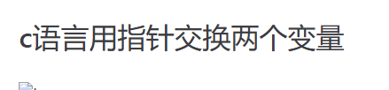
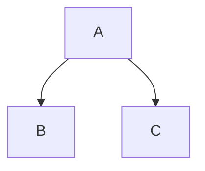
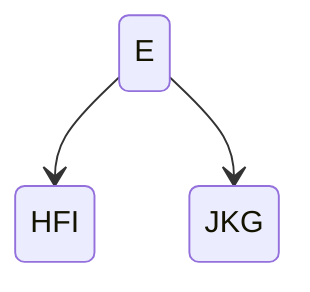
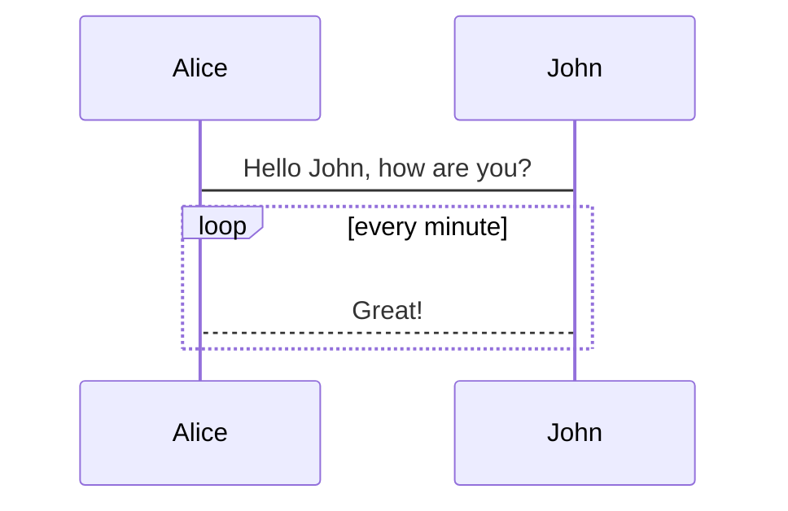

测试本地图片

```mermaid
graph TD;
A --> B
A --> C
```

```mermaid
stateDiagram-v2
E --> HFI
E --> JKG
```

```mermaid
sequenceDiagram
Alice->John: Hello John, how are you?
loop every minute
    John-->Alice: Great!
end
```