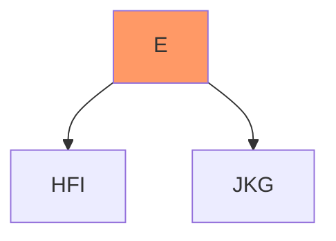
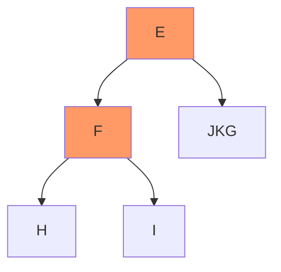
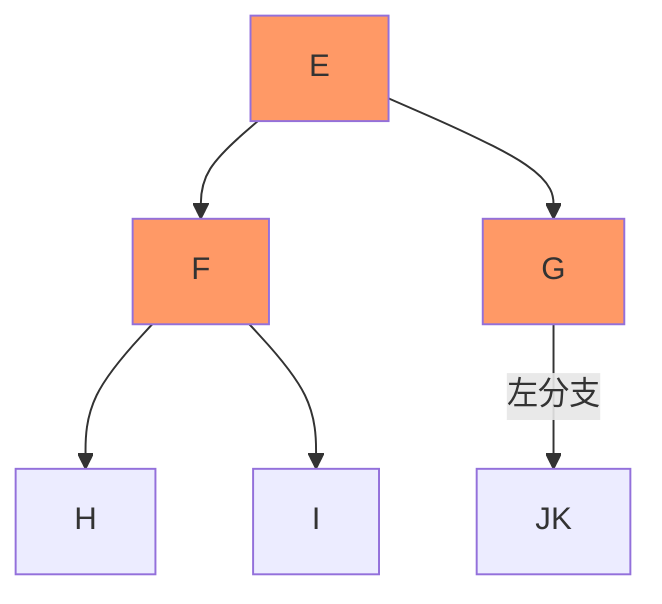
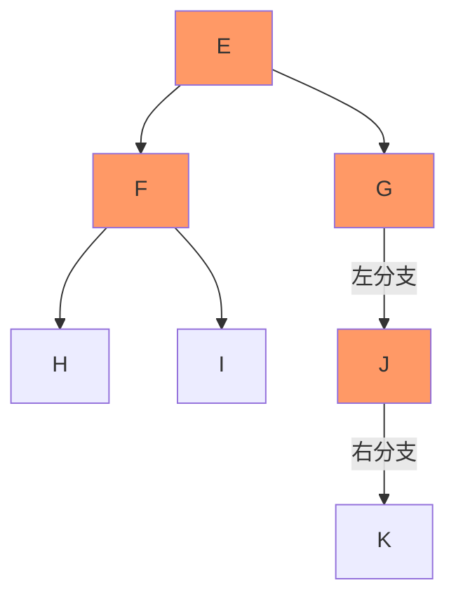

# 根据遍历序列画二叉树

 ## 【题目】
 某二叉树先序遍历序列是 **`EFHIGJK`** ， 中序遍历序列是 **`HFIEJKG`** ，画出该二叉树。

## 【答案】

1. 由先序 **EFHIGJK** 可知 **E** 是根节点。
2. 由中序 **HFIEJKG** ，可知 **HFI** 在根节点左边，**JKG** 在根节点右边。

3. 左边节点序列：先序是**FHI**，所以 **F** 是根节点。
4. 左边节点序列：中序**HFI**，所以 **H左I右**。

5. 右边节点序列：先序是 **GJK**，所以 **G** 是根节点。
6. 右边节点序列：中序 **JKG**，所以 **JK** 都在 **G** 左边。

7. 先序是 **JK** ，所以 **J** 是根节点。
8. 中序 **JK** ，所以 **K 在 J 右边**。

