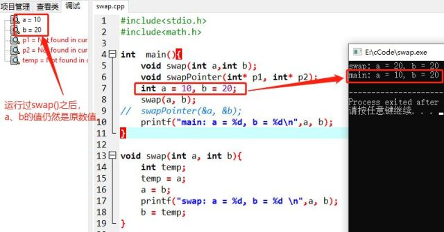
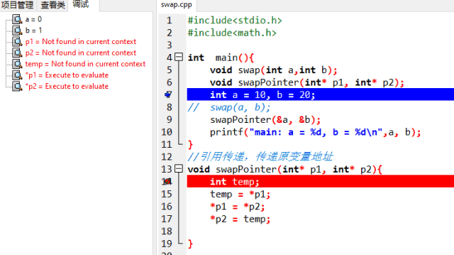
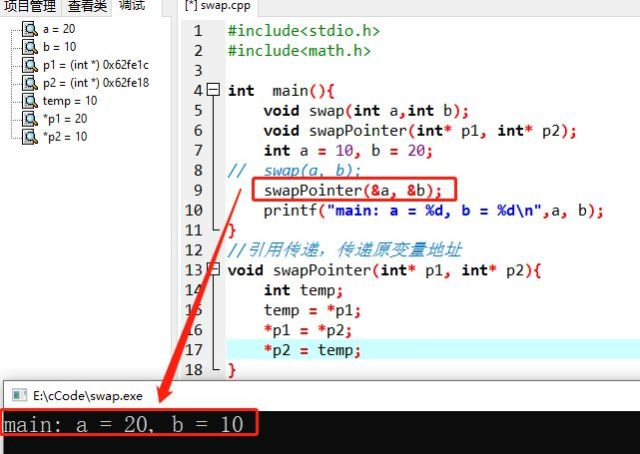

# 用指针交换两个变量

## 【代码】

```c
#include<stdio.h>
#include<math.h>

int  main(){
    void swap(int a,int b);
    void swapPointer(int* p1, int* p2);
    int a = 10, b = 20;
//    swap(a, b);
    swapPointer(&a, &b); // &a 是 int* 类型 
    printf("main: a = %d, b = %d\n",a, b);
}

//值传递，传递副本值 ,只是交换了a b的副本值，原有值没有交换
void swap(int a, int b){
    int temp;
    temp = a;
    a = b;
    printf("swap: a = %d, b = %d \n",a, b);
    b = temp;
}

//引用传递，传递原变量地址 
void swapPointer(int* p1, int* p2){
    int temp;
    temp = *p1; //指针 p1 所存地址中的内容，赋给 temp 
    *p1 = *p2;
    *p2 = temp;
}
```

## 【运行结果及解析】

swap函数是值传递，传递给实参的是形参的副本值，形参本身的值没有变。



swapPointer()是引用传递，在调用swapPointer(&a, &b);时，a、b的地址就传给了指针变量p1、p2，*p1=10，*p2=20。然后交换*p1、*p2的值（*p1 = *p2;是交换两个地址中的值，p1=p2是把p2中的地址值也改成了0x62fe1c）。


