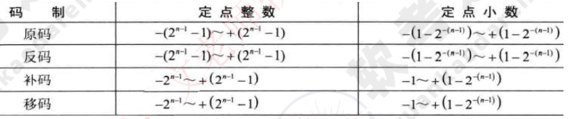

# 原码、反码、补码、移码表示范围、浮点数对阶

**机器数**：各种数值在计算机中表示的形式，其特点是使用二进制计数制，数的符号用0和1表示，小数点则隐含，不占位置。

机器数有无符号数和带符号数之分。

- 无符号数表示正数，没有符号位。

- 带符号数最高位为符号位，正数符号位为0，负数符号位为1。

**真值**：机器数对应的实际数值。

## 原码、反码、补码

**正数**：原码=反码=补码

**负数**：原码是绝对值的原码，然后把最高位（符号位）改为1；反码=（除符号位外）原码按位取反；补码=（除符号位外）反码+1。

**0**：分为 +0 和 -0 

- +0：原码：0000 0000；反码：0000 0000；补码：0000 0000
- -0：原码：1000 0000；反码：1111 1111；补码：0000 0000（溢出后舍弃最高位）

## 移码

补码首位（即符号位）取反。

移码用作浮点运算的阶码。

## 机器字长为n时，各种码制的表示范围（定点整数）

**原码**：n位数最高位是符号位，剩下（n-1）位表示数值大小，此时可表示 2n-1-1 个数，所以最小负数是 -（2n-1-1）。同理，最大正数为 2n-1-1。即原码的表示范围是 -(2n-1-1)~ +(2n-1-1) 。

**反码**：和原码一样，反码的表示范围也是 -(2n-1-1)~ +(2n-1-1) 。

**补码**：+0、-0的反码都是 0000 0000，所以补码的表示范围是 -(2n-1)~ +(2n-1-1) 

补码参考：

- [关于进制补码的八位取值范围为什么是-128~127和补码-128的求取_补码为什么是-128到127-CSDN博客](https://blog.csdn.net/boomandrice/article/details/126794706)、

- [为什么用二进制补码所能表示的数据范围比原码多一个数据单位（为什么8位二进制的补码取值范围是-128~127）_补码取值范围为什么大一位-CSDN博客](https://blog.csdn.net/Brave_Runer/article/details/106512781)。

**移码**：+0、-0的反码一样， 所以移码也一样。所以移码的表示范围和补码一样，都是 -(2n-1)~ +(2n-1-1) 。

## 机器字长为n时，各种码制的表示范围（定点小数）

参考链接：（[定点小数的取值范围是怎么推算出来的？ - 知乎 (zhihu.com)](https://www.zhihu.com/question/50758554)）

比如 0011 0011 是一个8位原码，此时它是一个整数，小数点位于最右侧（可以看做0011 0011.0），把它化为小数是 0.011 0011（最高位是符号位），数据向右移动了 n-1 位（相当于小数点向左移动了 n-1 位）。数据右移=小数点左移=除以2n-1，

**所以定点小数的表示范围就是【整数的表示范围除以2n-1】**

整数原码范围：-(2n-1-1)~ +(2n-1-1) ，**定点小数原码**范围：-(1-1/2n-1) , 1/2n-1可以表示为2-(n-1)，所以范围是 -(1-2-(n-1))~+(1-2-(n-1))

同理，整数反码范围： -(2n-1-1)~ +(2n-1-1)，**定点小数反码**范围 -(1-2-(n-1))~+(1-2-(n-1))

同理，整数补码范围： -(2n-1)~ +(2n-1-1) ，**定点小数补码**范围 -1~+(1-2-(n-1))

同理，移码补码范围： -(2n-1)~ +(2n-1-1) ，**定点小数移码**范围 -1~+(1-2-(n-1))

##  浮点数运算

**数据右移=小数点左移=除以2n-1**

浮点数的表示方法是 **尾数*2阶码**，尾数是纯小数，阶码是纯整数。正数表示为0.1xxxx，负数表示为1.0xxxx

- **对阶**：使两个数的阶码相同，**小阶向大阶看齐**，较小阶码增加几位，尾数就右移几位。

- **尾数计算**：相加，如果是减法则加负数；

- **结果规格化**：即尾数规格化，带符号数尾数转换为1.0xxx或0.1xxx。

小阶向大阶看齐 例子：

- 0101，数据左移两位 = 乘以2^2=0100，丢失高位，不能忍受
- 数据右移两位 = 除以2^2=0001，丢失低位，只影响精度，可以忍受